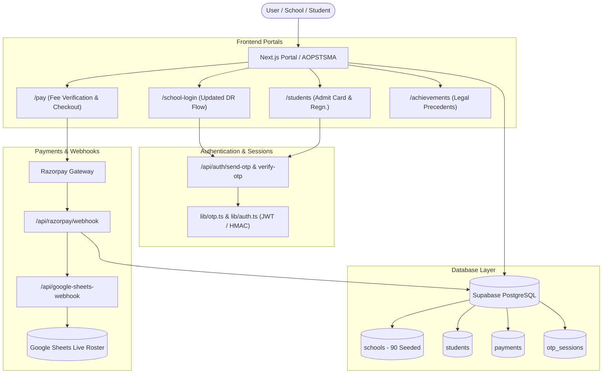

# 🛠️ AOPSTSMA — Master Infrastructure & Setup Guide
**All Orissa Private Secondary Training Schools Management Association**  
*Official Portal Implementation, Integrations & Deployment Manual*

---

## 📋 Table of Contents
1. [Architecture & System Flow](#1-architecture--system-flow)
2. [Step 1: Supabase Setup (Database & Schema Migration)](#step-1-supabase-setup)
3. [Step 2: Environment Variables Master File (`.env.local`)](#step-2-environment-variables-master-file)
4. [Step 3: OTP Authentication System (Dev Mode & Real SMS)](#step-3-otp-authentication-system)
5. [Step 4: Razorpay Payment Gateway Configuration](#step-4-razorpay-payment-gateway)
6. [Step 5: Google Sheets Live Data Sync (Apps Script Webhook)](#step-5-google-sheets-live-data-sync)
7. [Step 6: Student Data Capture & Descriptive Roll (DR) Roster](#step-6-student-data-capture--dr-roster)
8. [Step 7: Search Console, Analytics & SEO Verification](#step-7-search-console-analytics--seo)
9. [Step 8: Contact Form Backend (Formspree)](#step-8-contact-form-backend)
10. [Step 9: Vercel Deployment & Custom Domain (`aopstsma.in`)](#step-9-vercel-deployment--custom-domain)
11. [Step 10: Pre-Launch Verification Checklist](#step-10-pre-launch-verification-checklist)

---

## 1. Architecture & System Flow



---

## Step 1: Supabase Setup

### 1.1 Create Supabase Project
1. Navigate to **[supabase.com](https://supabase.com)** and sign in / sign up.
2. Click **New Project**:
   * **Project Name**: `aopstsma`
   * **Database Password**: Choose a strong password and save it securely.
   * **Region**: Select **Mumbai (`ap-south-1`)** for lowest latency across India.
   * Click **Create new project** (takes ~1–2 minutes to provision).

### 1.2 Copy API Credentials
1. In your Supabase Dashboard, click the **Settings (gear icon)** at the bottom of the left sidebar.
2. Select **API** under Configuration.
3. Copy the following 3 values:
   * **Project URL**: `https://xxxxxxxxxxxxxxxxxxxx.supabase.co`
   * **Project API Keys -> `anon` (public)**: `eyJhbGciOi...`
   * **Project API Keys -> `service_role` (secret)**: `eyJhbGciOi...` *(Keep this confidential)*

### 1.3 Run Database Migrations in SQL Editor
1. In the Supabase left sidebar, click **SQL Editor** (icon: `>_`) -> **New query**.
2. **First Query (Core Schema):**
   * Open the file in your project:  
     `supabase/migrations/20260909_init_schema.sql`
   * Copy the entire code, paste it into the SQL Editor, and click **Run**.
   * *Creates `schools`, `students`, `demands`, and `payments` tables with Row Level Security (RLS).*
3. **Second Query (OTP Auth & 90 Schools Seed):**
   * Open the file in your project:  
     `supabase/migrations/20260923_seed_schools_and_otp_auth.sql`
   * Copy the entire code, paste it into the SQL Editor, and click **Run**.
   * *Creates `school_contacts`, `otp_sessions` tables and inserts all 90 recognized member training schools.*

---

## Step 2: Environment Variables Master File

Create a file named **`.env.local`** in the root directory of the website (`c:\Users\lenovo\Downloads\aopstsma-website\.env.local`):

```env
# ============================================================
# AOPSTSMA PORTAL — ENVIRONMENT CONFIGURATION
# ============================================================

# 1. SUPABASE DATABASE (From Step 1)
NEXT_PUBLIC_SUPABASE_URL=https://xxxxxxxxxxxxxxxxxxxx.supabase.co
NEXT_PUBLIC_SUPABASE_ANON_KEY=eyJhbGciOi...
SUPABASE_SERVICE_ROLE_KEY=eyJhbGciOi...

# 2. RAZORPAY PAYMENT GATEWAY (From Step 4)
# In test mode: starts with rzp_test_
NEXT_PUBLIC_RAZORPAY_KEY_ID=rzp_test_XXXXXXXXXXXX
RAZORPAY_KEY_SECRET=your_razorpay_secret_key_here
RAZORPAY_WEBHOOK_SECRET=your_razorpay_webhook_secret_here

# 3. OTP & SESSION AUTHENTICATION (From Step 3)
JWT_SECRET=aopstsma_secure_session_secret_key_2026_odisha
# Optional: real SMS gateway API Key (e.g. 2Factor.in). Leave empty for dev test mode.
SMS_API_KEY=

# 4. GOOGLE SHEETS LIVE DATA SYNC (From Step 5)
GOOGLE_SHEET_WEBHOOK_URL=https://script.google.com/macros/s/AKfycb.../exec

# 5. GOOGLE & MICROSOFT ANALYTICS (From Step 7)
NEXT_PUBLIC_GA_MEASUREMENT_ID=G-XXXXXXXXXX
NEXT_PUBLIC_CLARITY_PROJECT_ID=your_clarity_project_id
NEXT_PUBLIC_GOOGLE_SITE_VERIFICATION=your_google_search_console_code
NEXT_PUBLIC_BING_SITE_VERIFICATION=your_bing_webmaster_code

# 6. CONTACT FORM BACKEND (From Step 8)
NEXT_PUBLIC_FORMSPREE_ID=your_formspree_form_id

# 7. BASE URL
NEXT_PUBLIC_BASE_URL=https://www.aopstsma.in
```

---

## Step 3: OTP Authentication System

The portal features an integrated OTP engine built in `lib/otp.ts` and `lib/auth.ts`:

### 3.1 Development / Zero-Cost Testing Mode (Ready Now)
* When `SMS_API_KEY` is not set or in local testing, the system runs in **Dev Mode**.
* When any School or Student clicks **Request OTP**:
  1. The 6-digit numeric OTP is printed directly in your terminal console:
     ```
     ======================================================
     🔔 [AOPSTSMA OTP DISPATCH] Mobile: +91-9861012345
     🔑 SECURE OTP CODE: [ 482910 ] (Valid for 5 mins)
     ======================================================
     ```
  2. The frontend also displays a developer test code banner, allowing instant testing without waiting for an SMS.

### 3.2 Production SMS Gateway (When Launching Live)
In India, TRAI mandates DLT registration for sending bulk transactional SMS:
1. Sign up on **[2Factor.in](https://2factor.in)** (recommended: ₹0.18 per SMS, instant setup).
2. Complete simple KYC and get your **API Key**.
3. Register your Sender ID (e.g., `AOPSTM`) on the DLT portal (e.g., VilPower / Jio DLT).
4. Register the message template:  
   `"Your AOPSTSMA verification OTP is {#var#}. Valid for 5 minutes."`
5. Place the key in `.env.local`:
   ```env
   SMS_API_KEY=your_2factor_api_key
   ```
   *The system will automatically switch from console logging to live SMS dispatch!*

---

## Step 4: Razorpay Payment Gateway

### 4.1 Account Creation & Association KYC
1. Visit **[razorpay.com](https://razorpay.com)** and sign up.
2. **Crucial:** Register under the official name:  
   `All Orissa Private Secondary Training Schools Management Association`.
3. Submit organization KYC:
   * Association PAN Card
   * Societies Registration Certificate (Regd. No. 1422/80)
   * Bank account details of the Association (Passbook or cancelled cheque).
   *(KYC verification takes 2–4 business days).*

### 4.2 Test Mode Setup (Immediate Testing)
1. While KYC is pending, you can immediately test using **Test Mode**.
2. Go to **Settings** -> **API Keys** -> Click **Generate Test Key**.
3. Copy:
   * `Key Id` (starts with `rzp_test_...`) -> `NEXT_PUBLIC_RAZORPAY_KEY_ID`
   * `Key Secret` -> `RAZORPAY_KEY_SECRET`

### 4.3 Configure Webhooks (Auto-Payment Confirmation)
1. In Razorpay Dashboard, go to **Settings** -> **Webhooks** -> **Add New Webhook**.
2. **Webhook URL**:  
   `https://www.aopstsma.in/api/razorpay/webhook`  
   *(For local testing with tools like ngrok: `https://your-ngrok-subdomain.ngrok-free.app/api/razorpay/webhook`)*
3. **Secret**: Enter a secure random string (e.g. `aopstsma_webhook_secret_2026`).
4. **Active Events**: Select:
   * `payment.captured`
   * `order.paid`
5. Save the secret in `.env.local` as `RAZORPAY_WEBHOOK_SECRET`.

---

## Step 5: Google Sheets Live Data Sync

Every payment completed via Razorpay is automatically captured and appended as a new row in Google Sheets via Apps Script.

### 5.1 Create Google Spreadsheet
1. Open Google Sheets ([sheets.new](https://sheets.new)).
2. Name the sheet: **`AOPSTSMA Payments & Roster 2026`**.
3. In Row 1, set up the column headers:
   | A | B | C | D | E | F | G | H | I |
   |---|---|---|---|---|---|---|---|---|
   | **Transaction ID** | **Order ID** | **Student / School Name** | **Mobile** | **Zone** | **Fee Type** | **Amount (₹)** | **Status** | **Timestamp** |

### 5.2 Create Google Apps Script Webhook
1. In your sheet, go to **Extensions** -> **Apps Script**.
2. Replace all existing code with the following snippet:
   ```javascript
   function doPost(e) {
     try {
       var sheet = SpreadsheetApp.getActiveSpreadsheet().getActiveSheet();
       var data = JSON.parse(e.postData.contents);
       
       sheet.appendRow([
         data.transactionId || '',
         data.orderId || '',
         data.name || data.studentName || '',
         data.mobile || '',
         data.zone || '',
         data.feeType || 'CT Exam Fee',
         data.amount ? (Number(data.amount) / 100) : 2500,
         data.status || 'Paid',
         new Date()
       ]);
       
       return ContentService.createTextOutput(JSON.stringify({ status: 'success' }))
         .setMimeType(ContentService.MimeType.JSON);
     } catch (err) {
       return ContentService.createTextOutput(JSON.stringify({ status: 'error', message: err.toString() }))
         .setMimeType(ContentService.MimeType.JSON);
     }
   }
   ```
3. Click **Deploy** (top right) -> **New deployment**.
4. Click the gear icon next to "Select type" and choose **Web app**.
5. Configure:
   * **Description**: `AOPSTSMA Webhook Receiver`
   * **Execute as**: `Me (your Google email)`
   * **Who has access**: `Anyone` *(Crucial: must be Anyone so server webhooks can post without OAuth login)*
6. Click **Deploy**, authorize permissions, and copy the **Web app URL** (`https://script.google.com/macros/s/.../exec`).
7. Paste this URL into your `.env.local` as `GOOGLE_SHEET_WEBHOOK_URL`.

---

## Step 6: Student Data Capture & DR Roster

There are two primary data capture mechanisms:

### Method A: Member School Bulk Roster Upload
1. School headmasters/secretaries log in at `/school-login` using the **DR OTP format**.
2. From their dashboard (`/school-dashboard`), they click **"Download Standard CSV Template"**.
3. They fill in their student roster:
   ```csv
   Student ID,Student Name,Mobile Number,Fee Payable
   STU-2026-101,Aarav Sharma,9861099999,2500
   STU-2026-102,Priya Mohanty,9437011111,2500
   ```
4. Click **"Import CSV Roster"** — records are immediately loaded into the school's verified roster.

### Method B: Student Direct Registration (Free / No Charge)
1. Prospective teacher trainees visit `/students` -> **"Registration (No Charge)"** tab.
2. Fill in: Full Name, Father's Name, Member School, Educational Zone, Mobile, and Document Scan.
3. Click **Submit** -> Generates an instant Provisional Enrollment ID (`AOP-2026-XXXX`).
4. Students can immediately verify their ₹2,500 examination fee status or download their Board Admit Card once approved.

---

## Step 7: Search Console, Analytics & SEO

### 7.1 Google Analytics 4 (GA4)
1. Visit **[analytics.google.com](https://analytics.google.com)**.
2. Create Account: `AOPSTSMA` -> Property: `AOPSTSMA Official Portal`.
3. Choose Platform: **Web** -> Website URL: `https://www.aopstsma.in`.
4. Copy the **Measurement ID** (`G-XXXXXXXXXX`).
5. Add to `.env.local`: `NEXT_PUBLIC_GA_MEASUREMENT_ID=G-XXXXXXXXXX`.

### 7.2 Microsoft Clarity (Free User Heatmaps & Recordings)
1. Visit **[clarity.microsoft.com](https://clarity.microsoft.com)**.
2. Create project -> Copy **Project ID**.
3. Add to `.env.local`: `NEXT_PUBLIC_CLARITY_PROJECT_ID=your_id`.

### 7.3 Google Search Console
1. Visit **[search.google.com/search-console](https://search.google.com/search-console)**.
2. Add Property -> Select **URL prefix**: `https://www.aopstsma.in`.
3. Choose verification method: **HTML tag**.
4. Copy the verification content string (e.g. `abc123xyz...`).
5. Add to `.env.local`: `NEXT_PUBLIC_GOOGLE_SITE_VERIFICATION=abc123xyz...`.
6. Once deployed, open Search Console -> **Sitemaps** -> Submit:  
   `https://www.aopstsma.in/sitemap.xml`.

---

## Step 8: Contact Form Backend

The contact form on `/contact` uses Formspree for reliable delivery without needing a private mail server:
1. Visit **[formspree.io](https://formspree.io)** and create a free account.
2. Click **New Form** -> Name: `AOPSTSMA Secretariat Contact`.
3. Set notification email to `info@aopstsma.in` (or your preferred inbox).
4. Copy the **Form ID** (the 8-character string at the end of the endpoint URL).
5. Add to `.env.local`: `NEXT_PUBLIC_FORMSPREE_ID=your_form_id`.

---

## Step 9: Vercel Deployment & Custom Domain

### 9.1 Deploy to Vercel
1. Push your project code to a GitHub repository:
   ```bash
   git add .
   git commit -m "feat: complete AOPSTSMA digital portal with OTP, legal archive, and admit cards"
   git push origin main
   ```
2. Log in to **[vercel.com](https://vercel.com)**.
3. Click **Add New Project** -> Import your GitHub repository.
4. Expand **Environment Variables** and paste all key-value pairs from your `.env.local` file.
5. Click **Deploy**.

### 9.2 Connect Domain (`aopstsma.in`)
1. In Vercel Project Dashboard, navigate to **Settings** -> **Domains**.
2. Add:
   * `aopstsma.in`
   * `www.aopstsma.in`
3. Log in to your domain registrar (GoDaddy, Hostinger, Namecheap, etc.) and open **DNS Management**.
4. Add / update these DNS records:
   * **Type A**: Host `@` -> Points to `76.76.21.21`
   * **Type CNAME**: Host `www` -> Points to `cname.vercel-dns.com`
5. Vercel will automatically verify DNS and issue a free SSL Certificate (HTTPS).

---

## Step 10: Pre-Launch Verification Checklist

Before publishing, verify the following core flows:

| Step | Action | Expected Result | Checked |
|:----:|:-------|:----------------|:-------:|
| 1 | Run `npx tsc --noEmit` | Exits with 0 errors | [x] |
| 2 | Open `/achievements` | 6 High Court orders, 3 Supreme Court orders, 3 BSE letters displayed with filters | [ ] |
| 3 | Open `/school-login` | Select Zone -> School -> Authority -> Mobile -> Request OTP -> Enter Code -> DR Loads to `/school-dashboard` | [ ] |
| 4 | Open `/students` | Enter `STU-2026-001` + `9861012345` -> OTP -> Board Admit Card renders with Print button | [ ] |
| 5 | Test Print Admit Card | Click Print -> Clean official admit card formatted for A4 printing | [ ] |
| 6 | Free Student Regn. | Fill registration form on `/students` -> Instant `AOP-2026-XXXX` ID generated | [ ] |
| 7 | Payment Checkout | Open `/pay` -> Verify student `STU-2026-001` -> Click Pay ₹2,500 -> Razorpay popup opens | [ ] |
| 8 | Google Sheets Sync | Perform test payment -> New row appears with timestamp in Google Sheet | [ ] |
| 9 | Check `robots.txt` & `sitemap.xml` | Open `/robots.txt` and `/sitemap.xml` -> Ensure `/students` and canonical URLs exist | [ ] |

---

## 📞 Central Support & Secretariat Contacts
* **Registered Headquarters**: Plot No. 4971/8, V.S.S. Nagar, Bhubaneswar, Khordha, Odisha — 751010
* **Secretariat Helpline**: `+91 63709 87576`
* **Email**: `info@aopstsma.in` / `support@aopstsma.in`
* **Legal Cell In-charge**: Raj Kishore Jena (General Secretary)
